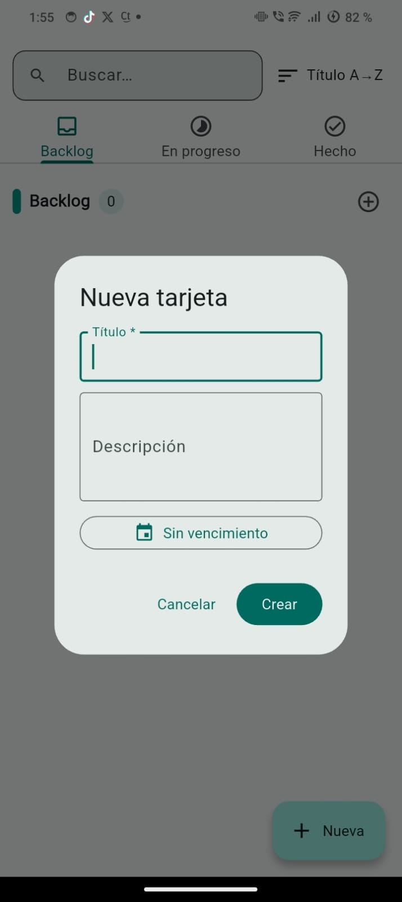
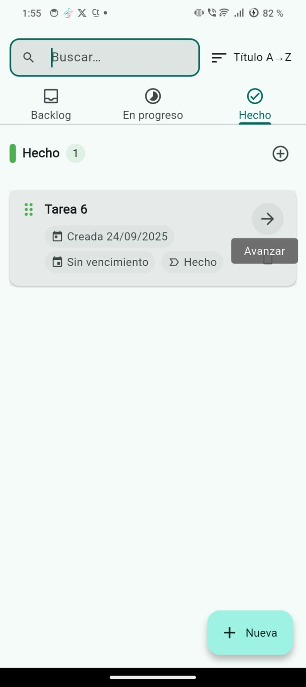
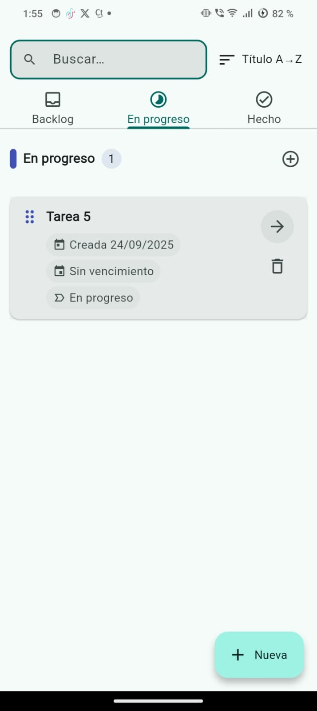
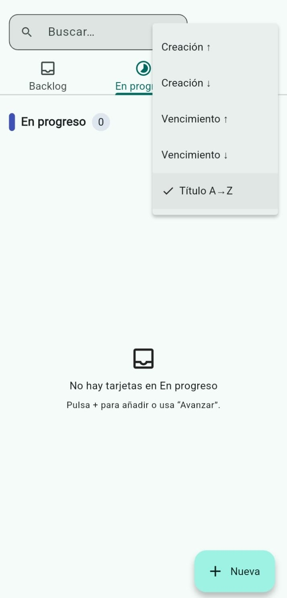

# KanbanAPP


Tablero Kanban **simple, rápido y sin distracciones** construido con Flutter. Crea tareas, organízalas entre **Backlog**, **En progreso** y **Hecho**, agrega fechas límite y sigue tu avance.

Completamente **offline-first** — sin cuentas, sin servidores, sin permisos innecesarios. Tus datos viven en tu dispositivo.

---

## Capturas de pantalla

| Vista móvil (claro) | Vista escritorio (oscuro) |
| :---: | :---: |
|  |  |

| Diálogo de edición | Estado vacío |
| :---: | :---: |
|  |  |

---

## Características

- **Tres columnas:** Backlog · En progreso · Hecho
- **Gestión de tareas:** título, descripción y fecha límite
- **Drag & drop** en escritorio y web
- **Responsive:** móvil con pestañas, escritorio con columnas simultáneas
- **Búsqueda y ordenamiento** por texto, fecha de creación, vencimiento o título
- **Notificaciones locales** de vencimiento
- **Modo claro / oscuro** automático según el sistema
- **Offline-first** con `shared_preferences` — sin cuenta ni backend
- **Privacidad total:** sin tracking, sin analytics, sin permisos innecesarios

---

## Plataformas

| Android | iOS | Web | Windows | macOS | Linux |
|:-------:|:---:|:---:|:-------:|:-----:|:-----:|
| ✓ | ✓ | ✓ | ✓ | ✓ | ✓ |

---

## Instalación

### Desde el APK (Android)

Descarga e instala directamente `app-release.apk` incluido en el repositorio:

```
Kanban-Flutter/app-release.apk
```

### Desde el código fuente

**Requisitos:** [Flutter SDK](https://flutter.dev/docs/get-started/install) 3.8+

```bash
git clone https://github.com/revkelo/Kanban-Flutter.git
cd Kanban-Flutter/KanbanAPP
flutter pub get
flutter run
```

Para compilar en release:

```bash
# Android
flutter build apk --release

# Web
flutter build web --release

# Windows
flutter build windows --release
```

---

## Stack

| | |
|--|--|
| Framework | Flutter 3.8 · Dart 3 |
| Persistencia | `shared_preferences` |
| Notificaciones | `flutter_local_notifications` |
| Links externos | `url_launcher` |

---

## Política de privacidad

Disponible en: [revkelo.github.io/Kanban-Flutter](https://revkelo.github.io/Kanban-Flutter/)

---

Desarrollado por **Kevin Gonzalez**
