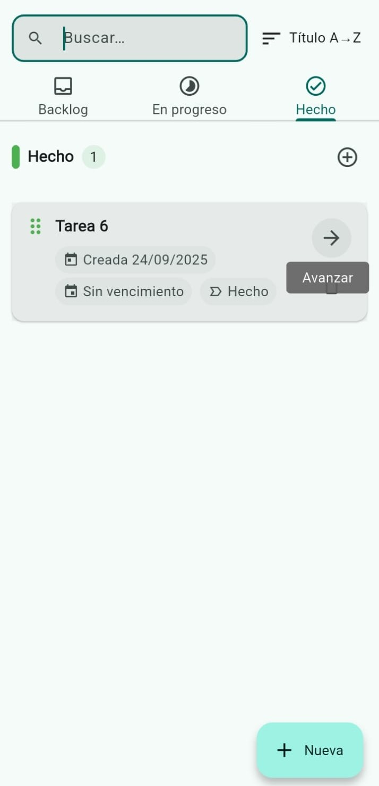

# Kanban Flutter


Aplicación de tablero Kanban simple, rápida y sin distracciones construida con Flutter.  
Crea tarjetas, organízalas entre las columnas **Backlog**, **En progreso** y **Hecho**, agrega fechas límite y sigue tu avance con una interfaz limpia y fluida.

La app es completamente *responsive*: en móvil usa pestañas y en escritorio/web muestra múltiples columnas con arrastrar y soltar.

---

## Características

- **Tablero Kanban simple**: tres etapas claras (Backlog, En progreso, Hecho).
- **Gestión de tareas**: crea, edita y elimina tareas con título, descripción y fecha límite.
- **Interfaz adaptable**  
  - **Móvil**: navegación por columnas con `TabBarView`.  
  - **Escritorio/Web**: todas las columnas visibles y *drag & drop*.
- **Búsqueda y ordenamiento**: por texto y por fecha de creación, vencimiento o título.
- **Offline-first**: persistencia local con `shared_preferences`.
- **Privacidad**: sin cuentas, sin registro, sin permisos innecesarios.
- **Modo claro/oscuro**: se adapta al tema del sistema.

---

## Capturas de pantalla

| Vista móvil (claro) | Vista escritorio (oscuro) |
| :---: | :---: |
|  |  |

| Diálogo de edición | Estado vacío |
| :---: | :---: |
|  |  |

| Tarjeta/Tarea |
| :---: |
|  |

---

## Plataformas compatibles

- Android · iOS · Web · Windows · macOS · Linux

---

## Cómo empezar

1. **Requisitos**: Instala el [SDK de Flutter](https://flutter.dev/docs/get-started/install).
2. **Clonar el repositorio**:
   ```sh
   git clone https://github.com/revkelo/Kanban-Flutter.git
   cd Kanban-Flutter/tareas_rapidas
